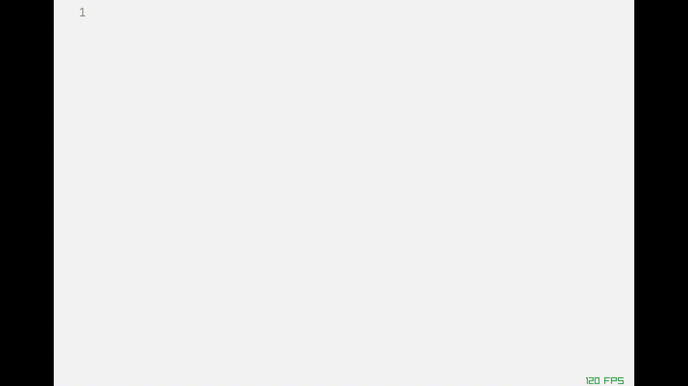

# text-editor-go
A simple text editor created using go.

For now, it has

- [x] Write characteres
- [x] Remove characteres
- [x] Support for multiple lines
- [x] Cursor showing current position
- [x] Move cursor thought the text
- [x] Add some basic syntax highlighting (only for go files at least for now)
- [x] Add line numbers
- [x] Basic identation
- [x] Home and End keys behaviour
- [x] Insert or delete new characters in the middle of a word
- [x] Syntax Highlighting for strings

WIP:

- [ ] Save file
- [ ] Open file